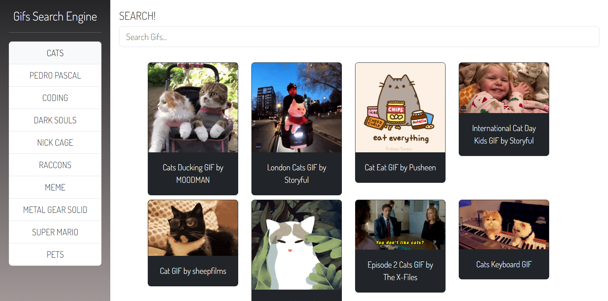

<a href="https://gif-search-engine-angularexercise.netlify.app/"># Angular Exercise - Gif Search Engine</a>

This is an Angular exercise that showcases the use of SOLID principles in creating components and modules to develop a WebApp. The app utilizes the Giphy API as a search engine for animated Gifs, and it also keeps track of the user's recent searches.

With this exercise, I will learn how to implement SOLID principles in an Angular project, as well as how to consume an external API and persist data in the browser's local storage.

## Development

Deployed at https://gif-search-engine-angularexercise.netlify.app/ through Netlify.

## Screnshots

